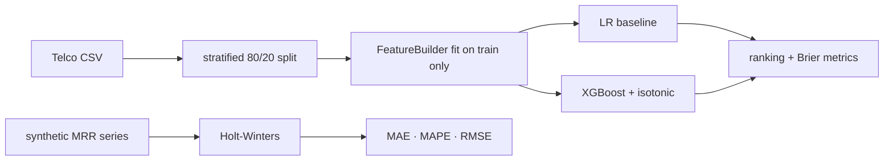

# churn-forecasting — calibrated churn ranking plus MRR forecasting, on open data

[](https://github.com/darrshangovender/churn-forecasting/actions/workflows/tests.yml)
[](LICENSE)
[](https://python.org)
[](https://xgboost.readthedocs.io)

> Two pipelines a retention team actually needs: a calibrated XGBoost churn classifier on the public Telco dataset, ranked by top-decile precision rather than accuracy, and a Holt-Winters MRR forecaster with intervals on a synthetic SaaS revenue series.

## Scope

This is a **public reference implementation**. The production version at the Agulhas Code client (under NDA) uses live billing data, real CSM-event signals, and pushes the ranked-customer list into their CRM. The reference impl here reproduces the same architecture and metrics on data anyone can re-run.

**Why this exists.** Churn models get graded on ROC-AUC and then handed to a CSM team who can call thirty accounts a week. Those are different problems. What matters is whether the top decile of the ranked list is dense with real churners, and whether the probability attached to each account means anything when someone acts on it — which is why both models here are isotonically calibrated and evaluated on ranking and Brier score, not accuracy at 0.5.

---

## Quick start

```bash
make install     # uv sync
make data        # download + cache the Telco CSV
make train       # fit LR baseline + calibrated XGBoost, write out/metrics.json
make forecast    # fit Holt-Winters, write the MRR forecast
make benchmark   # run both pipelines, write out/benchmark_results.json
```

```python
from churn import FeatureBuilder, XGBChurnClassifier, evaluate
from churn.data.loader import load_telco, split_telco

split = split_telco(load_telco(), test_size=0.2, random_state=42)
fb = FeatureBuilder().fit(split.X_train)

clf = XGBChurnClassifier(n_estimators=300, max_depth=5, learning_rate=0.08,
                         calibrate=True, random_state=42).fit(fb.transform(split.X_train), split.y_train)

m = evaluate(split.y_test, clf.predict_proba(fb.transform(split.X_test)))
print(m.roc_auc, m.pr_auc, m.top_decile_precision, m.brier)
```

```python
from mrr_forecast import generate_mrr_series, MRRForecaster, forecast_metrics

s = generate_mrr_series(n_months=36, start_mrr=50_000.0, seed=42,
                        churn_shock_at=18, churn_shock_pct=0.12)
fc = MRRForecaster(seasonal_periods=12, trend="add", seasonal="add").fit(s.iloc[:-6]).forecast(h=6)
print(forecast_metrics(s.iloc[-6:], fc.forecast))    # MAE, MAPE, RMSE
```

Metric tables are not published in this README. `make benchmark` writes them to `out/benchmark_results.json` on your machine, against the dataset version you actually downloaded — see the first limitation for why that distinction matters.

## How it works



1. `load_telco()` downloads or reads the cached Telco CSV, coerces `TotalCharges` to numeric, and derives a binary `churn` target.
2. `split_telco()` drops identifiers and stratifies 80/20 on the target.
3. `FeatureBuilder.fit()` learns the scaler and the one-hot column schema **on the training split only**.
4. `transform()` rebuilds features, back-fills any column the test set is missing with zero, and reindexes to the training schema.
5. Both models fit on the same matrix; XGBoost is wrapped in isotonic `CalibratedClassifierCV`.
6. `evaluate()` returns ROC-AUC, PR-AUC, top-decile and top-quintile precision, Brier, and the confusion matrix at 0.5.
7. Separately, the MRR generator produces a 36-month series; the forecaster fits on the first 30 and is scored on the last 6.

## What's modelled

| Component | Detail |
|---|---|
| `FeatureBuilder` | 16 one-hot categoricals, 3 z-scored numerics, plus a derived `services_count` |
| `LRBaseline` | `LogisticRegression(C=1.0, class_weight="balanced")` — the interpretable control |
| `XGBChurnClassifier` | 300 trees, depth 5, lr 0.08, `hist`, wrapped in isotonic calibration (cv=3) |
| `ChurnMetrics` | roc_auc · pr_auc · top_decile_precision · top_quintile_precision · brier · confusion |
| `generate_mrr_series` | Growth decelerating 6%→2%, ±2.5% annual seasonality, AR(1) noise (ρ=0.6), optional churn shock |
| `MRRForecaster` | statsmodels `ExponentialSmoothing`, additive trend and seasonality, estimated initialisation |

## Design decisions

| Decision | Why |
|---|---|
| **Top-decile precision as the headline metric** | A CSM team works a queue. Whether the first 10% of that queue is dense with real churners is the only question the business is asking; ROC-AUC averages over thresholds nobody will ever use. |
| **Isotonic calibration on top of XGBoost** | Gradient-boosted probabilities are systematically overconfident. If someone is going to offer a discount at "70% likely to churn", 70% has to mean 70%. |
| **An LR baseline nobody ships** | It exists so a stakeholder can read the coefficients and check they point the way domain sense says they should. When the two models disagree about direction, that is a data problem worth finding. |
| **Holt-Winters over Prophet** | Installs reliably everywhere, including Windows CI, where Prophet's pystan/cmdstanpy chain is fragile. Competitive on series under five years. `docs/prophet-config.md` describes the swap. |
| **The feature builder is fit on train only** | Obvious, and the single most common leak in churn code that has been through three hands. |

## Limitations

- **The data load has no integrity check, no retry, and no version pin.** It is a bare `requests.get` against a third-party repository's `master` branch, cached to disk with no checksum. If that CSV is re-ordered or edited upstream, caches silently diverge between machines and every "reproducible" metric shifts. It also fails hard offline with no local fallback.
- **Every MRR number is measured against data this repo generates.** The generator is the only series source, and the 12% churn shock is hand-placed at month 18 — inside the training window — so the hold-out contains no regime change the model wasn't already shown. This measures curve-fitting, not forecasting.
- **Prediction intervals are constant-width across the horizon.** Forecast variance grows with `h` for any exponential-smoothing model; this band does not. Worse, the `alpha` argument is effectively a two-valued switch — anything other than 0.2 silently returns a 95% band.
- **The Prophet extra installs a dependency no code path uses.** There is no Prophet forecaster class, no factory, no config switch. `docs/prophet-config.md` documents a swap you would have to write.
- **`services_count` is an English `startswith("no")` string test.** Correct for the Telco vocabulary, but any value beginning "no" is silently scored as inactive. This is the most predictive engineered feature and it rests on a string prefix.
- **`TotalCharges` nulls are imputed with `MonthlyCharges`**, which for a new customer encodes tenure into a column the model already sees separately — a mild, undocumented leak.
- **`notebooks/` is empty**, yet `jupyter` and `nbformat` are core dependencies and `make notebooks` targets the directory. That is a large install for nothing.

## Project layout

```
churn-forecasting/
├── churn/
│   ├── data/loader.py      # download · cache · clean · stratified split
│   ├── features.py         # FeatureBuilder: one-hot + scale + services_count
│   ├── models/             # baseline_lr · xgb (isotonic-calibrated)
│   ├── evaluation.py       # ranking + calibration metrics
│   └── pipeline.py         # end-to-end train + write artifacts
├── mrr_forecast/           # generator · Holt-Winters forecaster · metrics
├── benchmarks/run.py       # runs both pipelines → out/benchmark_results.json
├── tests/                  # 18 tests
└── docs/                   # churn-features · prophet-config
```

## Tests

```bash
make test        # 18 tests
```

The suite covers the feature builder's fit/transform contract, the metric definitions at their boundaries, model fitting, and the forecaster. It does not cover the data loader's network path. CI runs it on every push.

## Author

Darrshan Govender · [Agulhas Code](https://agulhascode.co.za) · Durban, South Africa
